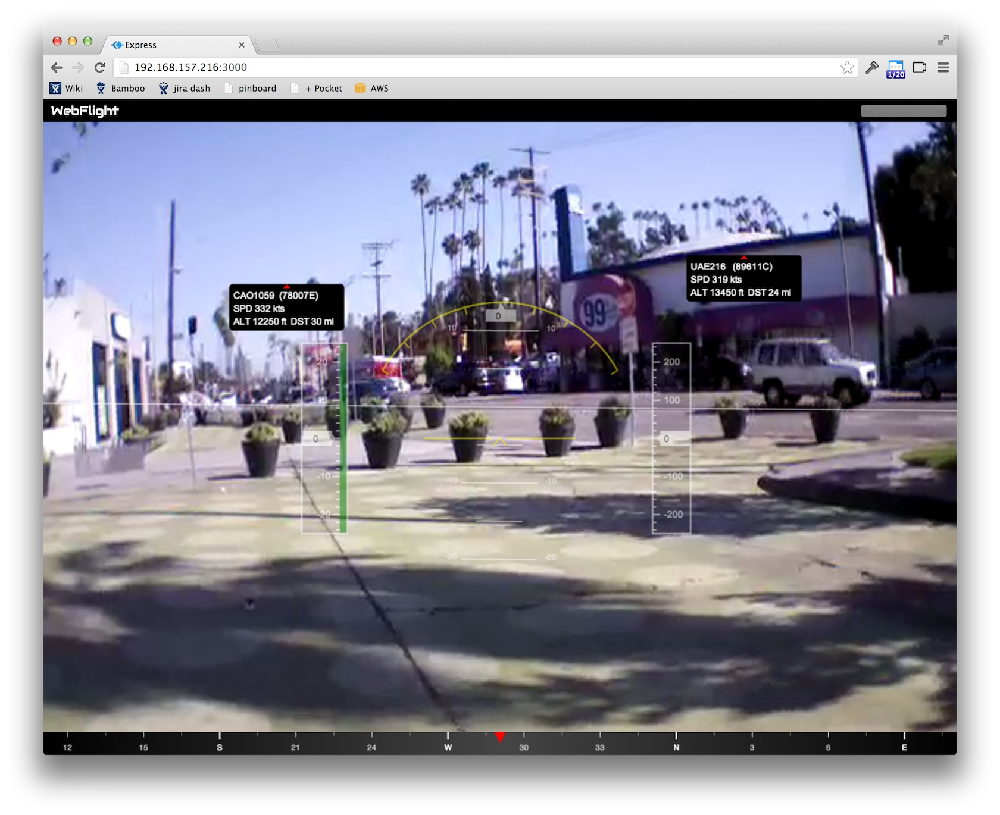

# webflight-traffic

This is a plugin for the browser-based AR.Drone ground control station
[webflight](http://eschnou.github.io/ardrone-webflight/) that displays
nearby aircraft overlaid on the drone's camera feed.



For background, see ["Cheap ADS-B on amateur
drones"](http://lemondronor.com/blog/indexphp/2013/4/cheap-ads-b-on-amateur-drones).


## How it works

To properly show air traffic onscreen we need to know 3 things:

1. Where the drone is.
2. The drone's attitude.
3. Where the traffic is.


### Where the drone is

The AR.Drone doesn't come with GPS, so for now I fake it:

```
this.dronePosition = {
  // Sunset Junction area of Los Angeles.
  // https://www.google.com/maps/preview#!q=34.090303%2C-118.276223
  lat: 34.090303,
  lon: -118.276223
};
```

There are a few other possible solutions:

1. Wait for Parrot to release the [Flight Recorder/GPS
module](http://ardrone2.parrot.com/flight-recorder/).

2. Put the AR.Drone's wifi into infrastructure mode, parse the output
of `iwlist ath0 scan` and pass nearby access point info to the [Google
geolocation
API](https://developers.google.com/maps/documentation/business/geolocation/#wifi_access_point_object).

3. Plug your own GPS into the drone's USB port.

### The drone's attitude

The AR.Drone has gyros, accelerometers and a magnetometer which give
us its heading, pitch and roll so we can figure out where on the video
feed to put the markers.

We just need to make sure we enable the magnetometer values in the
drone's navdata telemetry:

```javascript
function initDrone(client) {
  // From the AR.Drone SDK.
  var default_navdata_options = (
    navdata_option_mask(arDroneConstants.options.DEMO) |
    navdata_option_mask(arDroneConstants.options.VISION_DETECT));
  // Enable the magnetometer data.
  client.config('general:navdata_options',
                default_navdata_options |
                navdata_option_mask(arDroneConstants.options.MAGNETO));
}
```


### Where the traffic is

This plugin can use two possible sources to get locations of nearby
aircraft: an ADS-B receiver, or planefinder.net.  The recommended way
to use the plugin is with an ADS-B receiver.


#### ADS-B

Some aircraft (lots in Europe and Australia, some in the U.S.)
broadcast their GPS coordinates and other info using a scheme called
[ADS-B](http://en.wikipedia.org/wiki/Automatic_dependent_surveillance-broadcast).
For [$20 you can buy a USB RTL-SDR digital TV dongle that can actually
pick up ADS-B
broadcasts](http://www.irrational.net/2012/08/06/tracking-planes-for-20-or-less/).
You then have a virtual radar that can pick up aircraft from up to 100
miles away.

This plugin assumes there is an ADS-B decoder serving [SBS-1
style](https://github.com/wiseman/node-sbs1#readme) messages at
`localhost:30003`. There are instructions below on how to run a
decoder.


#### Planefinder.net

If you don't have an ADS-B receiver and you just want to see what the
traffic plugin looks like, you can tell it to get data from
planefinder.net by adding a small section to your config.js:

```javascript
  traffic: {
    planefinder: true
  }
```

By default the plugin will show only ADS-B traffic from
planefinder.net (vs. FAA-supplied data that is delayed by 5 minutes),
and it will update every two minutes--since planefinder doesn't have
an official API and we don't want to cause undue load on their
servers.

## Running the software

You will need the
[ardrone-webflight](https://github.com/eschnou/ardrone-webflight) and
webflight-traffic repos:

```
git clone git://github.com/eschnou/ardrone-webflight.git
git clone git://github.com/wiseman/webflight-traffic.git
```

Run `npm install` for each:

```
(cd ardrone-webflight && npm install)
(cd webflight-traffic && npm install)
```

Link `webflight-traffic` into webflight's `plugins` directory:

```
(cd ardrone-webflight/plugins && ln -s ../../webflight-traffic traffic)
```

Copy ardrone-webflight's `config.js.example` to `config.js`:

```
(cd ardrone-webflight && cp config.js.example config.js)
```

Add `"traffic"` to the `plugins` array in `config.js`, so it looks
something like this:

```
var config = {
    plugins: [
      "video-stream"  // Display the video as a native h264 stream decoded in JS 
      , "hud"         // Display the artificial horizon, altimeter, compass, etc.
      , "pilot"       // Pilot the drone with the keyboard
      , "traffic"     // Show ADS-B traffic.
    ]
};

module.exports = config;
```

Now you need to start an ADS-B decoder.  For these instructions we'll
assume you're using [dump1090](https://github.com/antirez/dump1090),
because it's easier to build than gnuradio and it can run onboard the
AR.Drone.  You have two options: running dump1090 on your laptop or
running it on the drone itself.

### Running dump1090 on your laptop

Follow the instructions at https://github.com/antirez/dump1090 to
build dump1090 (http://www.satsignal.eu/Radio/dump1090.html has some
more detailed instructions and may also be helpful).

Plug in the RTL-SDR dongle, then start dump1090 in network mode:

```
./dump1090 --interactive --aggressive --net
```


### Running dump1090 on the AR.Drone

Follow the instructions at
https://github.com/wiseman/ardrone-dump1090-cross-compiler to
cross-compile dump1090 for the AR.Drone, install it, and run it.

Then edit `ardrone-webflight/config.js` to tell webflight-traffic
where the dump1090 server is:

```
var config = {
    plugins: [
      "video-stream"  // Display the video as a native h264 stream decoded in JS 
      , "hud"         // Display the artificial horizon, altimeter, compass, etc.
      , "pilot"       // Pilot the drone with the keyboard
      , "traffic"     // Show ADS-B traffic.
    ],
    traffic: {
      sbs1_host: "192.168.1.1" // Or whereever you're running dump1090.
    }
};

module.exports = config;
```

### Start the server

Now you can start the webflight server:

```
(cd ardrone-webflight && node app.js)
```

And point your browser at http://localhost:3000/.
